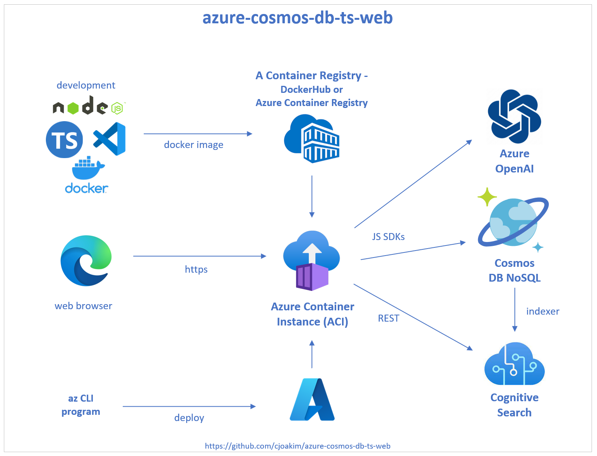
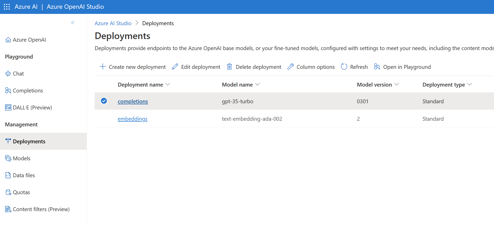

# azure-cosmos-db-ts-web

Express-based web application, implemented in TypeScript, using the azu-js
NPM package.  Featuring Azure Cosmos DB, et al.

## Purpose

This web application is intended for these purposes:

- To demonstrate the use of these **Azure PaaS Services**
  - **Azure Cosmos DB NoSQL API**
  - **Azure OpenAI**
  - **Azure Cognitive Search**
- To provide a working **Node.js and TypeScript starter application**
  - Which uses the **Azure SDK for JavaScript**
  - Which also uses the **azu-js** NPM library for ease of use 
  - Built on the popular **Express** web framework, thus suitable for either UI applications or microservices

The focus of the application is on **Azure Cosmos DB NoSQL API**.

The aim is to provide simple and reliable deployments via the use of a Docker image on DockerHub.

There are three **deployment modes** - **code, Docker Compose, or Azure Container Instance (ACI)**.<br>
Choose the deployment mode that best fits your needs.

See screenshots of the deployed application [here](SCREENSHOTS.md)

## Architecture

<p align="center">
  
</p>

---

## Required Software

The [git source control system](https://git-scm.com/download/win) is required
for all three deployment modes.

Clone (i.e. - copy) this GitHub repository to your workstation/laptop with the following command:

```
> cd ... some chosen directory ...
> git clone https://github.com/cjoakim/azure-cosmos-db-ts-web.git
> cd azure-cosmos-db-ts-web
```

Directory **azure-cosmos-db-ts-web** will now be referred to as the **GitHub root directory**
in this documentation.

The **environment variables** described below are **required** for all three
deployment modes.

### For Azure Container Instance (ACI) Deployment

- Windows 11, macOS, or Linux Developer workstation
- [az CLI (command line interface)](https://learn.microsoft.com/en-us/cli/azure/install-azure-cli)

### For Docker Desktop and Docker Compose Deployment

- Windows 11 Developer workstation
- [Docker Desktop](https://www.docker.com/products) installed and running

### For Code-based Deployment on Workstation

- Windows 11, macOS, or Linux Developer workstation
- [Node.js](https://nodejs.org/en) version 18 or higher

---

## Provisioning and Deployment

### Provisioning Azure PaaS Services

This GitHub project intentionally **does not** provision any Azure PaaS services
for you; the intent is for you to use **YOUR** existing Azure PaaS services with
this application.

**Note: It is strongly recommended that you use this application only with non-production PaaS services (i.e. - Cosmos DB, OpenAI, Cognitive Search) since it uses the HTTP protocol and basic authentication.**

You configure this application to use your Azure PaaS services with the
**environment variables** listed below.

### Environment Variables

This application uses the following **specific environment variable names**.
You must set these up on your local Developer workstation.

See your PaaS services in **Azure Portal** to obtain the values of most of 
these environment variables.

Note that these environment variables are used in all modes of deployment described below -
code, Docker Compose, or Azure Container Instance.

```
Name                                  Sample Value
------------------------------------  -----------------------------------------------
AZURE_COSMOSDB_NOSQL_RW_KEY1          vxQ7...
AZURE_COSMOSDB_NOSQL_URI              https://gbbcjcdbnosql.documents.azure.com:443/
AZURE_OPENAI_EMBEDDINGS_DEPLOYMENT    embeddings
AZURE_OPENAI_KEY1                     b910...
AZURE_OPENAI_URL                      https://cjz5mxhd2ciwy-openai.openai.azure.com/
AZURE_SEARCH_ADMIN_KEY                xWzu...
AZURE_SEARCH_NAME                     ngMx...
AZURE_SEARCH_URL                      https://gbbcjsearch.search.windows.net
AZURE_WEB_AUTH_USERS                  gues...
AZURE_WEB_COOKIE_AGE   (optional)     259200000
AZURE_WEB_COOKIE_KEYS  (optional)     irxG...
PORT                   (optional)     3000

AZURE_SUBSCRIPTION_ID  (optional)     <-- only used in the az CLI deployment scripts
```

For example, the Sample Values shown are for my deployment.
The **secret** values shown above are truncated with **...** characters for obvious reasons.

You'll need to configure a list of one or more authorized users with the **AZURE_WEB_AUTH_USERS**
variable, in the format shown below.  Note the use of a double-tilde to separate users, and single-tilde characters to delimit the id and password values for each user.  Tilde characters
may not be present in either the ID or Password values.

```
user1_id~user1_password~~user1_id~user1_password~~user1_id~user1_password
```

You can re-implement class **AuthRouter** to use an alternative authorization and authentication
method, such as Microsoft Entra (formerly Azure Active Directory).
See https://learn.microsoft.com/en-us/azure/active-directory/develop/tutorial-v2-nodejs-webapp-msal

The **HTTP PORT** defaults to 3000.

See the NPM **cookie-session** Express library regarding the values for the 
**AZURE_WEB_COOKIE_KEYS** and **AZURE_WEB_COOKIE_AGE** environment variables,
but the defaults should be adequate.

#### Setting Environment Variables

On Windows 11, one way to set environment values is with this PowerShell syntax:

```
> [Environment]::SetEnvironmentVariable("PORT", "3000", "User")
```

Set the environment variables, then restart PowerShell to see the updated environment variables.

#### Azure Cosmos DB NoSQL API Containers

Though you **"Bring your own Cosmos DB Account"** to this application, it is recommended that you
**create the following two Cosmos DB NoSQL API containers**:

- **airports**, partition key **/pk**, with minimum throughput
- **baseballplayers**, partition key **/playerID**, with minimum throughput

The GitHub repository contains the following JSON data files that you can upload via the web UI.
These can be used to populate the above two containers, respectively.

- data/world-airports-50.json
- data/baseball-players.json

#### Azure OpenAI

It is assumed that you have created an **text-embedding-ada-002** model whose name is
specified in the **AZURE_OPENAI_EMBEDDINGS_DEPLOYMENT** environment variable.

The following screenshot, for example, shows a model deployment named **embeddings** Azure OpenAI Studio.

<p align="center">
  
</p>

#### Azure Cognitive Search

At this time, this project assumes that you already have an Azure Cognitive Search
account with an Index populated from your Cosmos DB container.

This repo will be enhanced in October/November 2023 to create a Cognitive Search
Datasource, Index, and Indexer from specified environment variables.

### Deployment - With Docker Compose on Developer Workstation

This deployment mode assumes that you have [Docker Desktop](https://www.docker.com/products)
installed and running on your Windows 11 workstation.

It uses the latest version of the **cjoakim/azure-cosmos-db-ts-web** image on **DockerHub**

From **PowerShell**, execute the following script in the GitHub root directory:

```
> docker compose -f docker-compose-web.yml up
```

The application should be accessable from your browser at http://localhost:3000

To stop the web application enter the following command in another PowerShell window or tab:

```
> docker compose -f docker-compose-web.yml down
```

### Deployment - To an Azure Container Instance (ACI)

Within your GitHub root directory, change directories into the **az** directory,
then enter the following command:

```
> az login
```

The edit file **provision-webapp-aci-prod.ps1** with your Azure subscription, 
and preferred resource group name, ACI resource name, and region name.

```
# Parameters - change these per your Azure environment
$subscription=$Env:AZURE_SUBSCRIPTION_ID
$resource_group='gbbcjcosmosplus'
$resource_name='gbbcjcosmosplus'
$azure_location='eastus'
```

Then execute this script with the following command:

```
> .\provision-webapp-aci-prod.ps1
```

Azure will then deploy the DockerHub container to the ACI instance, and the
application will be available at URL http://<resource_name>.eastus.azurecontainer.io:3000/

### Deployment - Using the GitHub repository source code

First, in PowerShell, install these two NPM libraries on your workstation/laptop

```
> npm install -g typescript
> npm install -g nodemon
```

Then, cd to the GitHub root directory and install the necessary NPM libraries.

```
> .\install.ps1
```

To start the web application on your workstation/laptop, run the following command,
and point your web-browser to http://localhost:3000

```
> .\web.ps1
```

For macOS and Linux users, the execute the install.sh and web.sh scripts instead.

---

## Roadmap / Development Backlog

- Use the REST API to create an Azure Cognitive Search Index populated from Cosmos DB
- Demonstrate Multi-Region configuration
- Describe Private-Link configuration
- Possible "show code" popups

## A Dataset Used : The Sean Lahman Baseball Database

The [Sean Lahman Baseball Database](http://seanlahman.com/download-baseball-database/)
is used by this repository, under the
[Creative Commons License](https://creativecommons.org/licenses/by-sa/3.0/).
See file **data/baseball-players.json**
